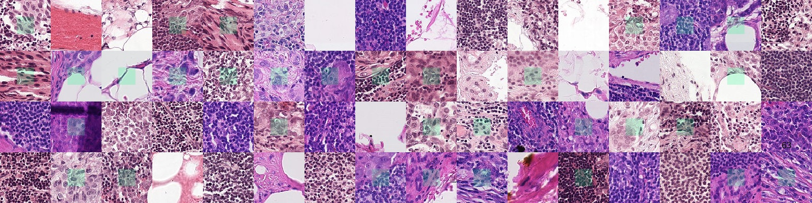

# 🧠 Transfer Learning Framework in PyTorch

A **modular, extensible and fully-tested transfer learning framework** built with PyTorch.  
Designed to compare different fine-tuning strategies across **natural image datasets and medical imaging data**.

---

## 🚀 Project Highlights

- ✅ Clean object-oriented design  
- ✅ Multiple fine-tuning strategies (Strategy Pattern)  
- ✅ Support for multiple datasets and pretrained models  
- ✅ Feature extraction & PCA visualization  
- ✅ Extensive pytest test suite  
- ✅ Code quality enforced with Black, Mypy and Flake8  

---

## 📁 Repository Structure

```text
.
├── images/          # Figures and visual results used in the README
├── src/             # Core framework implementation
├── tests/           # Unit and integration tests
├── README.md
├── pyproject.toml   # Tooling configuration 
├── pytest.ini
├── uv.lock
└── .python-version
```

---

## 🧠 Framework Architecture

The framework is designed with a clear separation of concerns:

- **DataManager**  
  Handles dataset loading, preprocessing and DataLoader creation.

- **ModelHandler**  
  Loads pretrained models and dynamically adapts their final layers.

- **FineTuningStrategy**  
  Encapsulates training behavior using the Strategy pattern.

- **FeatureVisualizer**  
  Extracts deep features and visualizes them using PCA.

<p align="center">
  
</p>

---

## 📊 Supported Datasets

### CIFAR-10
Standard object classification benchmark.

<p align="center">
  
</p>

---

### Oxford-IIIT Pet Dataset (Binary: Cat vs Dog)
Used to analyze feature separability in transfer learning.

---

### PCAM (PatchCamelyon)
Histopathology dataset for binary tumor detection.

<p align="center">
  
</p>

---

## 🧪 Fine-Tuning Strategies

| Strategy | Description |
|--------|-------------|
| **LastLayerStrategy** | Freeze backbone, train classifier only |
| **FullFineTuningStrategy** | Train all model parameters |
| **FeatureExtractionStrategy** | CNN as fixed feature extractor + Logistic Regression |

Each strategy is fully tested and interchangeable.

---

## 📈 Feature Visualization

CNN features are extracted and projected to 2D using **PCA** to analyze representation quality.

This allows comparison between:
- Natural image domains (cats vs dogs)
- Medical imaging domains (tumor vs normal tissue)

Highlighting how **source–target similarity affects transfer learning performance**.

---

## 🧪 Testing & Code Quality

Run the full test suite:

```bash
pytest tests
```

## 🛠️ Tech Stack

- Python  
- PyTorch / Torchvision  
- NumPy  
- scikit-learn  
- Matplotlib  
- pytest

---

> Transfer learning shifts the focus from training models to reusing representations;
this project explores that shift through modular design and systematic evaluation.

